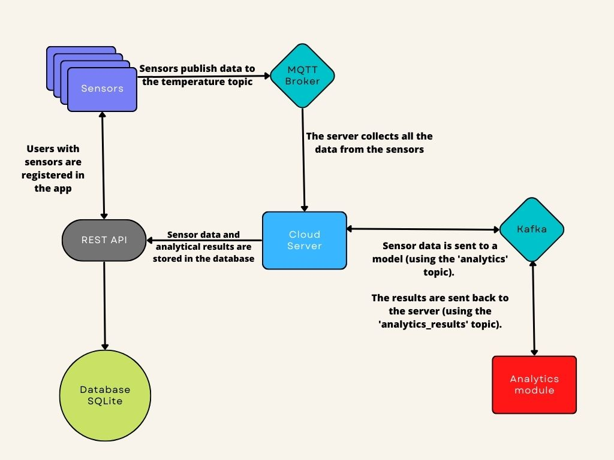

# IoT application with docker containers

## 1. Authors
1. Marc Vivas Baiges

## Table of Contents
1. [Authors](#1-authors)
2. [Introduction](#2-introduction)
3. [How to run the application](#3-how-to-run-the-application)
4. [Description of each component](#4-description-of-each-component)
5. [Design decisions](#5-design-decisions) 
6. [Conclusions and time spent](#6-conclusions)
7. [References](#7-references)

## 2. Introduction
This project consists of the creation of an IoT application.  

  
  
> Note 1: The sensors will be simulated using docker containers.  
> Note 2: More information about the project in `./statement.pdf`.
<br>  

## 3. How to run the application

First, you have to go to the folder where the `docker-compose.yml` file is located.  

Once there, you can execute the next command to run the application.

```bash
sudo docker compose up --scale sensor=1
```

> Note: The number of sensors can be changed by increasing the number of the command. (sensor=2, sensor=3 ...)  

You will have to wait for all the containers to be up and running, this takes a bit of time. Sometimes
while the application is starting you could see something to crash, not always but, don't worry, the service
will restart and stabilize, don't touch anything!. 

To know if the application is running, you should see messages like this in the terminal:
```
project-sensor-4            | Sensor 44b4f68f5c2e has now sent a message to the server!
project-server-1            | Server: Message received from sensor 44b4f68f5c2e
project-server-1            | The server has now sent data from the sensor 44b4f68f5c2e to the analytics module!
project-analytics_module-1  | ------------- Analytics module -------------
project-analytics_module-1  | Message received!
project-analytics_module-1  | ConsumerRecord(topic='analytics', partition=0, offset=35, timestamp=1669453778454, timestamp_type=0, key=None, value={'v': '21.0', 'ts': '2022-11-26 09:09:38', 'sensor': '44b4f68f5c2e', 'id': 1}, headers=[], checksum=None, serialized_key_size=-1, serialized_value_size=70, serialized_header_size=-1) is being processed
project-sensor-2            | Sensor a7c0968ea3f7 has now sent a message to the server!
```
If everything works well, you can open a browser and go to http://localhost:8081/db/server/ (mongo-express) to view the data that is being processed.         
<br>

## 4. Description of each component
### Sensors
Sensors send the data they collect from `data2.csv` to the server by using an MQTT broker.
Sensors publish the gathered data to the `temperature` topic every 10 seconds. The server will subscribe to this topic in order to receive the sensor's information.    

The messages the server will receive are in JSON format and have this structure:
```node
let message = {
  "sensorId": String, // Identifier of the sensor. It's the container HOSTNAME.
  "temperature": Number, // Temperature captured by the sensor, extracted from the csv file.
  'collectedAt': Date // When the temperature was captured
}
```

The sensor code is available in the `./IoT_devices` folder, to be more specific the name of the file is `sensor.js`.

### Analytics module
The Analytic_module receives sensor data from the server and uses an AI model to make predictions.
The predictions are sent back to the server, which will store them.  

The Analytics_module will be consuming sensor data that is being published to the 
`analytics` Kafka topic. Once a new message arrives, the analytics module will make a prediction.
The result will be sent back to the server using the `analytics_results` Kafka topic. 

The messages the server will receive are in JSON format and have this structure:
```node
let message = {
    "ds": Date,         // Collection date
    "yhat": Number,     // Temperature prediction
    "yhat_lower": Number,   // Temperature prediction
    "yhat_upper": Number,   // Temperature prediction
    "sensor": String    // Sensor identifier
}
```
The analytics module code is available in the `./Analytics_module` folder, to be more specific the name of the file is `consumer.py`.

### Server

The server's responsibility is to receive data from the sensors and the analytics module. Immediately 
after it receives a message, the server will store the data in the database.

#### Sensors ==> Server ===> Analytics_module communication
The server will subscribe to the `temperature` MQTT topic and will wait for new messages.
After receiving a message, the server will store the content of it in the database. As soon as it finishes,
the server will send the sensor data to the Analytics_module using the `analytics` Kafka topic.

The message the Analytics_module will get has the following structure:  
```node
let message = {
  "v": Number,    // Captured temperature
  "ts": Date,   // When the data was captured
  "sensor": String  // Sensor id
}
```

#### Analytics_module ===> Server communication
The server consumes data that is sent to the `analytics_results` Kafka topic. 
When it receives a new message, the server stores it in the database.

The server code is available in the `./Cloud_service` folder, to be more specific the name of the file is `server.js`.

### Database
The responsibility of the database is to store the analytics results and the sensor's information. This data is stored in two timeseries collections. The collections are titled:
1. model_predictions
2. sensors

#### Sensor collection
The sensor collection stores documents with the following structure:
```node
let sensorDoc = {
  "temperature": Number,      // Captured temperature
  "collected_at": Date,       // Collection date
  "metadata": {
    "sensor_id": String       // Id of the sensor
  }
}
```

#### Model prediction collection
The model prediction collection stores documents with the following structure:
```node
let modelPredictionDoc = {
  "date": Date,       // Collection date
  "y_hat": Number,   // Temperature prediction
  "y_hat_lower": Number,  // Prediction
  "y_hat_upper": Number,  // Prediction
  "metadata": {
    "sensor_id": String,  // Id of the sensor
  }
}
```
> Note: The data is stored using time series collections, an optimized way of storing time series in MongoDB. 
### Mongo express
This service lets us visualize the data that is being stored in the database. 
You can access this service if you visit the following page http://localhost:8081/db/server/ .

## 5. Design decisions

### Programming languages
The sensors and the server are written in JavaScript. The project could have been written in
any popular language, I've chosen JS because I wanted to gain more experience with it.  
  
The analytics module, which has been given, is written in Python.

### Database
The database that is used is **MongoDB**. The type of data it is wanted to be stored are time 
series, which are basically measurements ordered in time. MongoDB offers an optimized way to store
this type of data, 
they are called [time series collections](https://www.mongodb.com/docs/manual/core/timeseries-collections/#time-series-collections).

In order to interact with the database, the server uses an npm package called [mongoose](https://mongoosejs.com/).

The content of the database is not going to be stored on the host computer, 
since I'm not interested on the data. For this reason, only while the system is running you 
will be able to access it. 

### Analytics module modification
`consumer.py` has been slightly modified in order to receive and send JSON messages 
instead of Python dictionaries.

The Analytics_module now also creates the `analytics_results` Kafka topic if it does not exist. 

Some prints have also been added to keep better track of what the service is doing.


### MQTT
The server and the sensors will be using an npm package called 
[mqtt.js](https://www.npmjs.com/package/mqtt) in order to communicate with the chosen 
MQTT broker, which is called [mosquitto](https://mosquitto.org/).

The reason to use mosquitto is because it was taught during class.

### Kafka
The server and the sensors will be using npm package called [kafka-node](https://www.npmjs.com/package/kafka-node)
to communicate with the chosen Kafka broker, which is called [cp-kafka](https://hub.docker.com/r/confluentinc/cp-kafka/).

I first tried Bitnami Kafka but it didn't work, so I decided to use the alternative I just mentioned.

Kafka needs [Zookeeper](https://zookeeper.apache.org/) to work properly, so this is also installed in
its own container.


### Dockerize
[Dockerize]( https://github.com/jwilder/dockerize) is a tool that allows services to wait for other services to be ready. The next services 
are using dockerize:  
1. Server: Waits for Kafka, Zookeeper, Mosquitto and Mongo to be ready.
2. Sensors: Wait for Mosquitto to be ready.
3. Analytic_module: Waits for Kafka and Zookeeper to be prepared.

## 6. Conclusions
The requirements of the statement have been fulfilled. The next goal is to implement a RESTful API 
to access the data stored, but this is something it will be done in the next part of the project.
 
Personally, I enjoyed this project, as I learned how to work with Docker, which I find very interesting and useful.  

Approximate time spent: **51 hours**. 

## 7. References
1. Environment variables: https://stackoverflow.com/questions/52650775/how-to-pass-environment-variables-from-docker-compose-into-the-nodejs-project
2. MQTT.js: https://www.npmjs.com/package/mqtt#end
3. MQTT.js tutorial: https://www.emqx.com/en/blog/mqtt-js-tutorial
4. Create the same service multiple times: https://karthi-net.medium.com/how-to-scale-services-using-docker-compose-31d7b83a6648
5. Callback hell: https://codearmy.co/que-es-el-callback-hell-y-como-evitarlo-4af418a6ed14
6. Kafka tutorial: https://www.jymslab.com/ejemplo-simple-de-kafka-node-js/
7. Dataframe column to datetime: https://stackoverflow.com/questions/26763344/convert-pandas-column-to-datetime
8. Dataframe to json: https://pandas.pydata.org/pandas-docs/stable/reference/api/pandas.DataFrame.to_json.html
9. JSON parse: https://stackoverflow.com/questions/42494823/json-parse-returns-string-instead-of-object
10. Kafka confluent: https://docs.confluent.io/platform/current/installation/docker/config-reference.html#required-confluent-enterprise-ak-settings
11. MongoDB time series: https://www.mongodb.com/docs/manual/core/timeseries-collections/
12. Mongoose time series tutorial: https://stackoverflow.com/questions/70717856/how-to-create-time-series-collection-with-mongoose
13. How to wait other services to be ready: https://github.com/jwilder/dockerize 
14. Insert image, markdown: https://stackoverflow.com/questions/41604263/how-do-i-display-local-image-in-markdown
15. Table of contents, markdown: https://stackoverflow.com/questions/11948245/markdown-to-create-pages-and-table-of-contents/33433098#paragraph2


