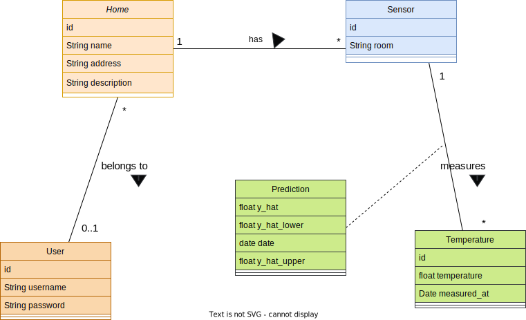

# MyClimate API

## Table of contents
1. [Author](#1-author)
2. [About MyClimate project](#2-about-myclimate-project)
3. [Horus spent]()

## 1. Author
Marc Vivas Baiges

## 2. About MyClimate project

## Built with
The project is built with **Laravel 9** which is a php framework.

## UML Class Diagram

## API Docs
The API endpoints are documented in the file named `api_doc.yaml`. In order to preview 
the API endpoints in a friendly UI and interact with it, 
open [Swagger Editor](https://editor.swagger.io/)and import the file.  

## Hours spent
- December 2 2022: 16:30 - 19:30 ->  <strong> 3 hours </strong>  
- December 3 2022: 8:40 - 
- December 4 2022: 
- <strong>  Total:   ?? hours  </strong> 
