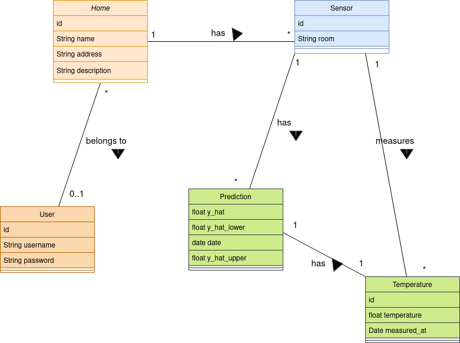

# MyClimate API

## Table of contents
1. [Author](#1-author)
2. [About MyClimate project](#2-about-myclimate-api-project)
3. [Hours spent]()

## 1. Author
Marc Vivas Baiges

## 2. About MyClimate API project
This system allows users to remote managing information related with
climate installation homes, sensors and users within a web services system.

## Built with
The project is built with **Laravel 9** which is a php framework.

## UML Class Diagram

## API Docs
The API endpoints are documented in the file named `api_doc.yaml`. In order to preview 
the API endpoints in a friendly UI and interact with it, 
open [Swagger Editor](https://editor.swagger.io/) and import the file.  

## Project structure
In case you have never seen a Laravel project, it can be quite hard to 
find the code that really matters. For this reason, now I will show you where
are the most important files.
## Hours spent
- December 2 2022: 16:30 - 19:30  Project planning ->  <strong> 3 hours </strong>  
- December 3 2022: 9:00 - 17:30 Project development -> <strong> 8.5 hours </strong> 
- December 4 2022: 8:00 -       Project development -> <strong> 8.5 hours </strong>
- <strong>  Total:   ?? hours  </strong> 

## References
1. API token authentication: https://laravel.com/docs/9.x/sanctum#api-token-authentication
